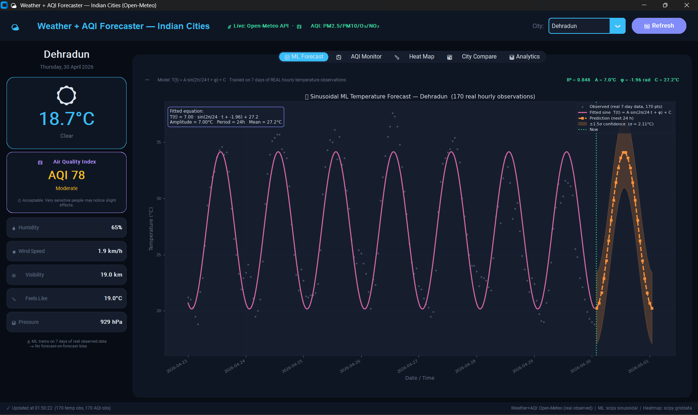
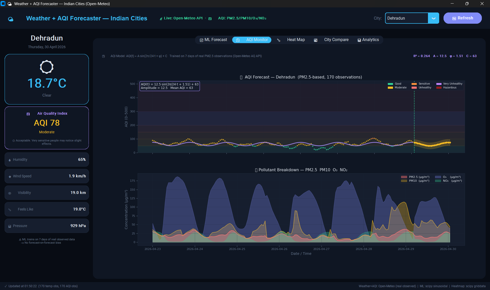
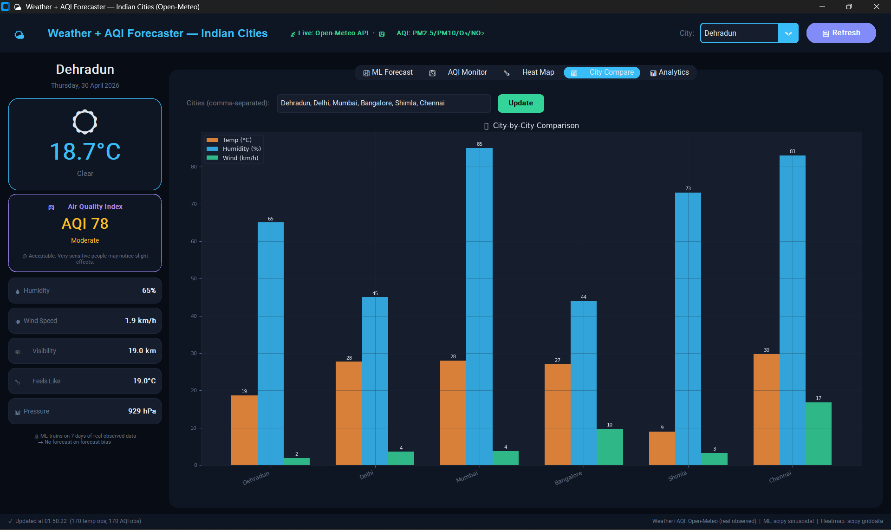
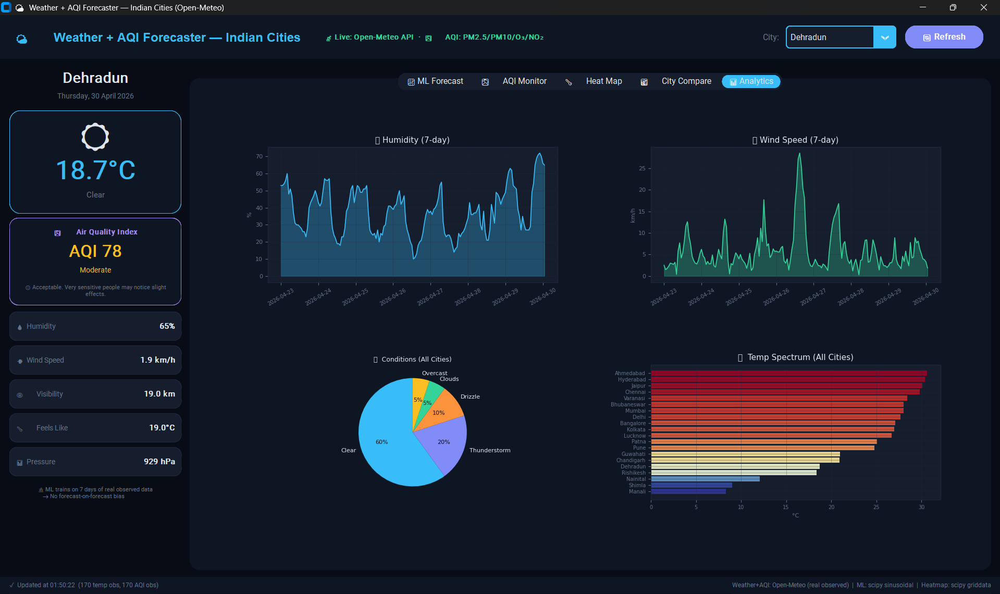

# 🌤️ Weather + AQI Forecaster

## 👥 Team Members

* Chirag Singh
* Gaurav Bakshi
* Varanya Thapa

---

## 📌 Project Description

This project is a Python-based desktop application that provides **real-time weather and air quality (AQI) data** for multiple Indian cities.

It also uses a **Machine Learning model** to predict future temperature and AQI trends based on real historical data.

---

## ⚙️ Features

* 📈 24-hour temperature prediction using ML
* 🌫️ AQI monitoring and forecasting
* 🌡️ Heatmap visualization of Indian cities
* 🏙️ City comparison dashboard
* 📊 Analytics panel (humidity, wind, conditions)
* 🔄 Real-time data from Open-Meteo API

---

## 🧠 How It Works

The system uses a **sinusoidal regression model** to capture daily patterns in temperature and AQI.

Formula used:
T(t) = A · sin(2π/24 · t + φ) + C

* **A (Amplitude)** → variation in temperature
* **φ (Phase)** → time of peak temperature
* **C (Offset)** → average temperature

The model is trained on **7 days of real hourly data** and predicts the next 24 hours.

---

## 📂 Project Structure

```id="final1"
Weather-AQI-App/
│── weather_aqi_app.py     # Main application (UI + ML + API integration)
│── requirements.txt       # Required Python libraries
│── README.md              # Project documentation
```

---

## 🛠️ Technologies Used

* Python
* NumPy, Pandas
* Matplotlib
* SciPy
* Scikit-learn
* CustomTkinter
* Open-Meteo API

---

## ▶️ How to Run

### 1. Install dependencies

pip install -r requirements.txt

### 2. Run the application

python weather_aqi_app.py

---

## 💻 Note

This is a **desktop GUI application**, so it runs locally on your system and not in the browser.

---

## 📸 Screenshots

### 📊 ML Forecast



### 🌬️ AQI Monitor



### 🏙️ City Comparison



### 📈 Analytics Dashboard



---

## 🌐 Data Source

* Open-Meteo API (real-time weather & AQI data)

---

## 🚀 Future Improvements

* Deploy as web application
* Add more advanced ML models
* Improve UI responsiveness
* Add historical trend analysis

---
